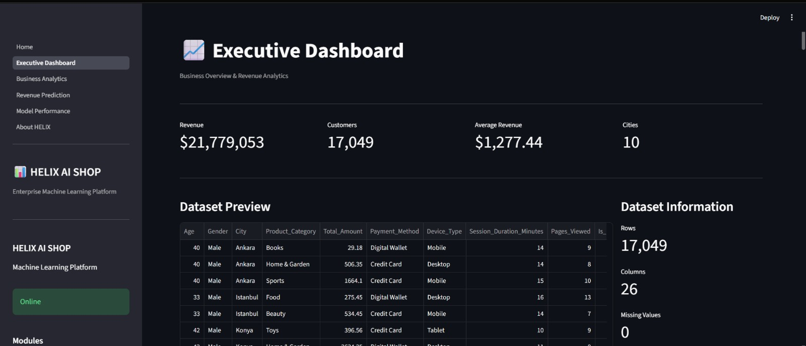
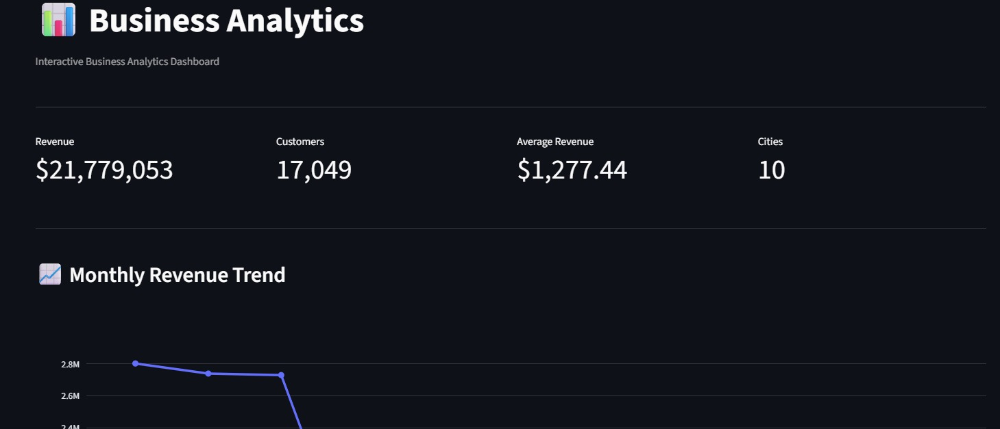
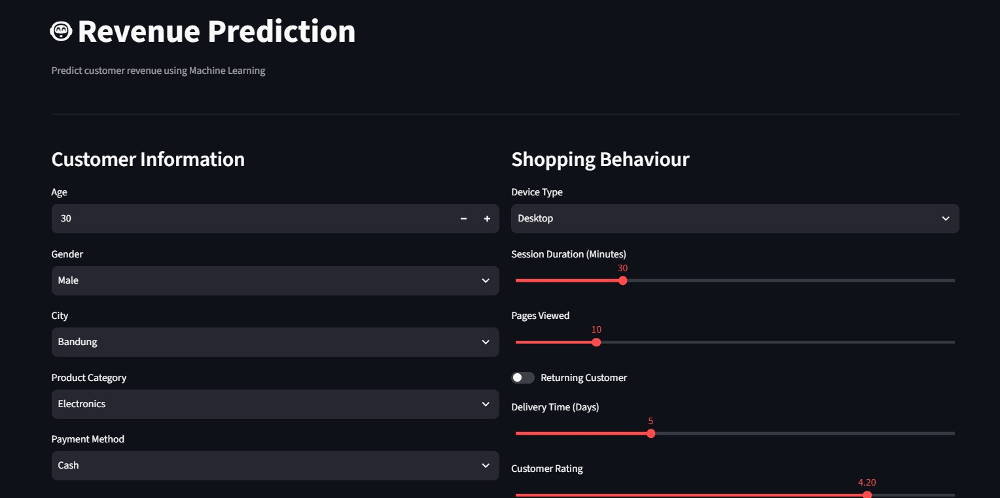
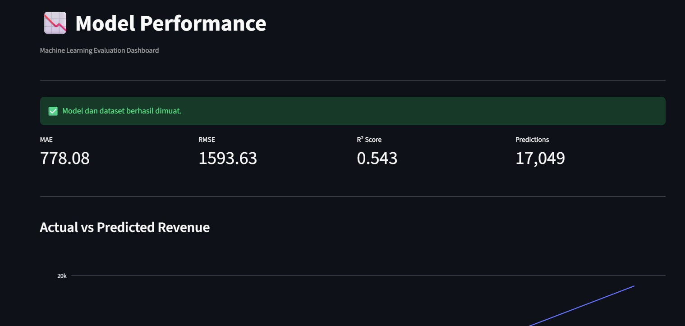

# 🚀 HELIX – Enterprise Revenue Intelligence Platform


HELIX is an end-to-end Machine Learning application designed to support **business decision-making through revenue prediction and interactive analytics**.

The platform combines **FastAPI**, **Streamlit**, and **CatBoost** into a modern enterprise-ready architecture that enables users to:

- 📈 Monitor business performance
- 🤖 Predict customer revenue
- 📊 Explore business analytics
- 📉 Evaluate machine learning performance

---

# 📌 Project Overview

HELIX demonstrates how a machine learning model can be deployed as an enterprise analytics platform.

Instead of only training a model, this project covers the complete ML lifecycle:

- Data Processing
- Feature Engineering
- Model Training
- REST API Development
- Interactive Dashboard
- Model Evaluation

The objective is to transform raw customer transaction data into actionable business insights.

---

# 📸 Dashboard Preview

## 🏠 Home


> Landing page introducing HELIX, technology stack, project overview, and platform capabilities.

---

## 📈 Executive Dashboard



> Executive-level KPIs including Total Revenue, Total Customers, Average Revenue, Geographic Distribution, and key business metrics.

---

## 📊 Business Analytics



> Interactive analytics for revenue trends, customer demographics, payment methods, product categories, and business insights.

---

## 🤖 Revenue Prediction



> Machine Learning interface for predicting customer revenue with downloadable prediction results and business recommendations.

---

## 📉 Model Performance



> Evaluation dashboard displaying MAE, RMSE, R² Score, Actual vs Predicted Revenue, Residual Analysis, and Feature Importance.

# 🏗 System Architecture

```

```
                    ┌─────────────────────────┐
                    │    Customer Dataset     │
                    └────────────┬────────────┘
                                 │
                                 ▼
                     Data Cleaning & Processing
                                 │
                                 ▼
                     Feature Engineering Pipeline
                                 │
                                 ▼
                      CatBoost ML Pipeline
                                 │
                ┌────────────────┴────────────────┐
                ▼                                 ▼
         FastAPI Prediction API           Evaluation Dataset
                │                                 │
                ▼                                 ▼
      Revenue Prediction Service         Model Performance
                │
                ▼
      Streamlit Enterprise Dashboard
                │
 ┌──────────────┼──────────────────────────┐
 ▼              ▼              ▼           ▼
Home     Executive Dashboard   Business Analytics
                                   Revenue Prediction
```

---

# 🏛 Application Architecture

```

```
HELIX
│
├── api/
│   ├── routers/
│   ├── services/
│   ├── schemas/
│   └── main.py
│
├── data/
│   ├── raw/
│   ├── processed/
│   └── external/
│
├── models/
│   ├── best_boosting_pipeline.pkl
│   └── artifacts
│
├── notebooks/
│
├── streamlit/
│   ├── Home.py
│   ├── pages/
│   ├── components/
│   └── assets/
│
├── training/
│
└── requirements.txt
```

---

# ⚙ Machine Learning Workflow

```

```
Raw Dataset
      │
      ▼
Data Cleaning
      │
      ▼
Feature Engineering
      │
      ▼
Train / Validation Split
      │
      ▼
CatBoost Regressor
      │
      ▼
Pipeline Serialization
      │
      ▼
FastAPI Deployment
      │
      ▼
Streamlit Dashboard
```

---

# 📊 Dashboard Features

## 🏠 Home

- Project overview
- Technology stack
- System summary

---

## 📈 Executive Dashboard

Executive-level KPI monitoring.

Features:

- Total Revenue
- Total Customers
- Average Revenue
- Geographic Distribution
- Revenue by Category
- Revenue by City
- Payment Analysis
- Device Analysis

---

## 📊 Business Analytics

Interactive business exploration.

Features:

- Revenue Trend
- Category Performance
- Customer Demographics
- Delivery Analysis
- Rating Analysis
- Payment Analysis
- Correlation Matrix

---

## 🤖 Revenue Prediction

Machine Learning prediction interface.

Input:

- Customer Age
- Gender
- Product Category
- Quantity
- Payment Method
- Device Used
- Shipping Method
- Customer Location

Output:

- Predicted Revenue
- Business Recommendation
- Download Prediction Result

---

## 📉 Model Performance

Model evaluation dashboard.

Includes:

- MAE
- RMSE
- R² Score
- Actual vs Prediction
- Residual Distribution
- Residual Plot
- Feature Importance

---

# 🧠 Machine Learning Model

| Model | CatBoost Regressor |
|--------|--------------------|
| Task | Revenue Prediction |
| Framework | Scikit-Learn Pipeline |
| Evaluation | MAE, RMSE, R² |
| Deployment | FastAPI |

---

# 🛠 Technology Stack

### Backend

- FastAPI
- Pydantic
- Uvicorn

### Machine Learning

- CatBoost
- Scikit-Learn
- Joblib
- Pandas
- NumPy

### Dashboard

- Streamlit
- Plotly

### Development

- Python 3.12
- Git
- VS Code

---

# 📂 Project Structure

```

```
HELIX/
│
├── api/
├── data/
├── models/
├── notebooks/
├── streamlit/
│   ├── Home.py
│   ├── components/
│   ├── pages/
│   └── assets/
│
├── training/
├── requirements.txt
└── README.md
```

---

# 🚀 Installation

Clone repository

```bash
git clone https://github.com/yourusername/helix-ai-shop.git
```

Create virtual environment

```bash
python -m venv .venv
```

Activate environment

```bash
source .venv/bin/activate
```

Windows

```bash
.venv\Scripts\activate
```

Install dependencies

```bash
pip install -r requirements.txt
```

Run FastAPI

```bash
uvicorn api.main:app --reload
```

Run Streamlit

```bash
streamlit run streamlit/Home.py
```

---

# 📈 Future Improvements

- Docker Deployment
- CI/CD Pipeline
- MLflow Experiment Tracking
- User Authentication
- Cloud Deployment
- Monitoring & Logging

---

# 👨‍💻 Author

**Hilmi Aji**

Bachelor of Agricultural Engineering — Institut Teknologi Bandung (ITB)

Aspiring AI Engineer | Machine Learning Engineer | Business Intelligence | Data Scientist

LinkedIn:
*(Add your LinkedIn URL)*

GitHub:
*(Add your GitHub URL)*

---

# ⭐ Acknowledgement

This project was developed as an end-to-end machine learning portfolio demonstrating modern practices in:

- Machine Learning Engineering
- API Development
- Interactive Dashboard
- Business Analytics
- Revenue Prediction